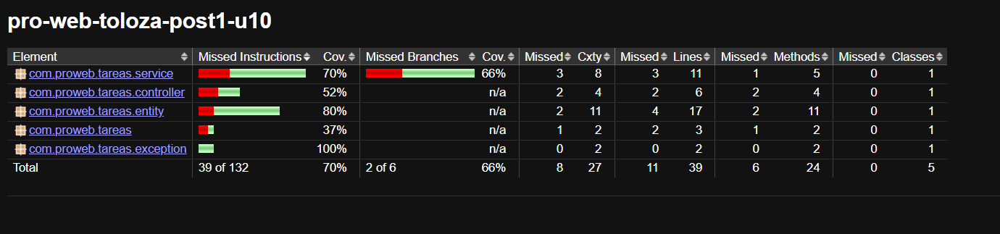

# U10 Post 1 - Suite de Pruebas con JUnit 5, Mockito y JaCoCo

## Descripción
Implementación de una suite de pruebas automatizadas sobre una aplicación Spring Boot de gestión de tareas, aplicando JUnit 5 y Mockito para pruebas unitarias, @WebMvcTest para la capa de controladores, @DataJpaTest para la capa de repositorios, y JaCoCo para medir y verificar la cobertura de código.

## Requisitos
- Java 17+
- Spring Boot 3.2.x
- Maven 3.9.x
- IDE: IntelliJ IDEA o VS Code con Extension Pack for Java

## Estructura del Proyecto
```
src/main/java/com/proweb/tareas/
├── entity/
│   └── Tarea.java              # Entidad principal
├── repository/
│   └── TareaRepository.java    # DAO con JpaRepository
├── service/
│   └── TareaService.java       # Lógica de negocio
└── controller/
    └── TareaController.java    # REST Controller

src/test/java/com/proweb/tareas/
├── TareaServiceTest.java       # Tests unitarios con Mockito
├── TareaControllerTest.java    # Tests con @WebMvcTest
└── TareaRepositoryTest.java    # Tests con @DataJpaTest
```

## Ejecución de Pruebas

### Ejecutar todos los tests
```bash
mvn test
```

### Cobertura con JaCoCo
```bash
mvn clean test
mvn jacoco:report
```
Reporte interactivo en: `target/site/jacoco/index.html`

### Verificar umbral de cobertura
```bash
mvn clean test jacoco:check
```

## Checkpoints Implementados

### ✓ Checkpoint 1: Entidad Tarea
- Entidad Tarea con @Entity y @Id
- Campos: id, titulo, descripcion, completada, fechaCreacion
- TareaRepository extendiendo JpaRepository

### ✓ Checkpoint 2: TareaService
- Lógica de negocio en servicio
- Inyección de dependencias
- Métodos: crear(), obtener(), listar(), actualizar(), eliminar()

### ✓ Checkpoint 3: TareaController
- REST endpoints (@GetMapping, @PostMapping, @PutMapping, @DeleteMapping)
- Manejo de estados HTTP
- Comunicación con TareaService

### ✓ Checkpoint 4: Suite de Pruebas
- Tests unitarios con Mockito (@Mock, @InjectMocks, verify)
- Tests de integración con @WebMvcTest (MockMvc)
- Tests de persistencia con @DataJpaTest y TestEntityManager
- Cobertura de código medida con JaCoCo

## Evidencias

### Test JaCoCo Report


## Tecnologías Utilizadas
- **JUnit 5**: Framework de testing
- **Mockito**: Framework para crear mocks
- **AssertJ**: Fluent assertions
- **MockMvc**: Testing de controladores
- **H2 Database**: BD en memoria para tests
- **JaCoCo**: Cobertura de código

## Commits Realizados
- `feat: estructura base de tareas`
- `test: agregar suite de pruebas`
- `docs: agregar README y carpeta img`
